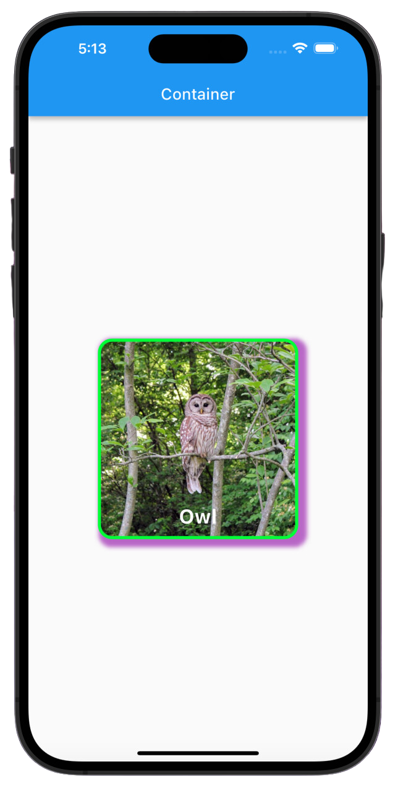
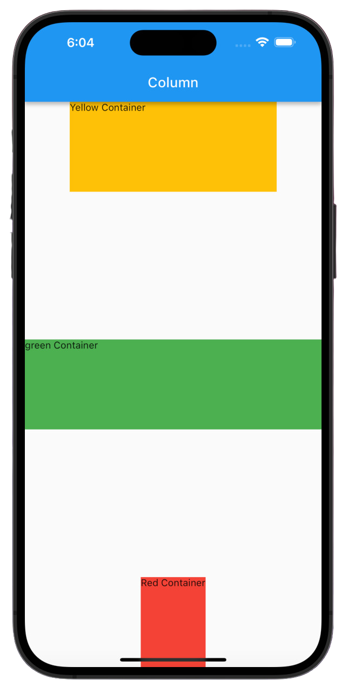
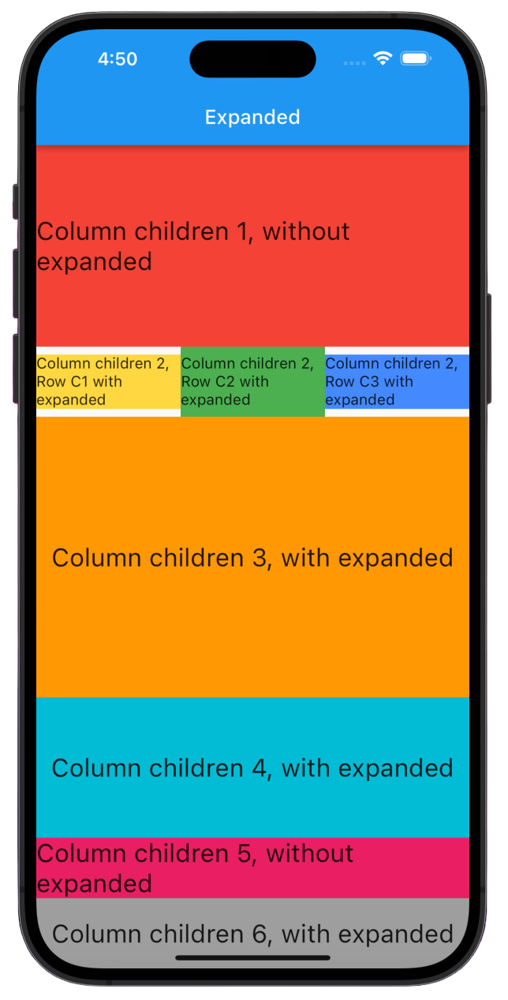

# 🌟 Flutter Widgets for Beginners 🌟

Welcome to Flutter Widgets for Beginners, a one-stop resource for new Flutter developers to learn about the basics of widgets in Flutter! 🚀 This GitHub repository aims to help beginners like yourself understand and explore various widgets in Flutter, step by step. If you are just getting started with Flutter, this project is designed to make your learning journey enjoyable and straightforward. 🎉

## What are Widgets? 🤔

In Flutter, everything is a widget! Widgets are the basic building blocks of a Flutter app's user interface. They define the structure, layout, and behavior of the UI components, allowing you to create visually appealing and interactive apps. 💡

## Getting Started

If you're new to Flutter, don't worry! We've got you covered. To get started, follow these simple steps:

1. Install Flutter: If you haven't already installed Flutter on your machine, refer to the official [Flutter installation guide](https://flutter.dev/docs/get-started/install) for detailed instructions.

2. Clone the Repository: Clone this repository to your local machine using Git.

```
git clone https://github.com/sharjeelmazhar/flutter-widgets-for-beginners.git
```

3. Explore the Widgets: Every day, a new widget will be added to the repository. Start with Day 1 and progress through the daily folders to learn about different widgets.

4. Study the Code: Each daily folder contains a Flutter project that demonstrates the widget of the day. Dive into the code, read the comments, and understand how the widget is implemented.

5. Experiment: Don't be afraid to experiment with the code! Modify the widgets, try out different properties, and see how the changes affect the UI.

6. Join the Community: Learning together is more fun! Feel free to ask questions, share your progress, and connect with other beginners in the Flutter community.

## Repository Structure 📁

The repository is organized as follows:

```
flutter-widgets-for-beginners/
  ├── lib/
  │   ├── widgets/
  │   │   ├── container.dart
  │   │   ├── expanded.dart
  │   │   └── ... (other widget files)
  │   └── widgets_screenshots/
  │       ├── Container.jpg
  │       ├── Expanded.jpg
  │       └── ... (other widget screenshots)
  └── main.dart

```

1. The `lib` folder contains the main source code for the Flutter app. 📂
2. The `widgets` folder contains individual widget files, such as `container.dart`, `expanded.dart`, and more, each demonstrating a specific Flutter widget. 📦
3. The `widgets_screenshots` folder can be used to store screenshots or images of how each widget looks when rendered. 📸

## How to Use This Repository 📝

Each day, a new Flutter widget will be added to the `widgets` folder. To explore and learn about a specific widget:

1. Open the `main.dart` file, which serves as the entry point of the app. 🏁

2. Import the desired widget's file at the top of `main.dart`. For example, to learn about the `Expanded` widget:

```dart
import 'package:flutter/material.dart';
import 'package:widgets/widgets/expanded.dart';

void main() {
  runApp(const MyApp());
}

class MyApp extends StatelessWidget {
  const MyApp({super.key});

  // This widget is the root of your application.
  @override
  Widget build(BuildContext context) {
    return const MaterialApp(
      debugShowCheckedModeBanner: false,
      home: Expandedd(), // Use the imported widget here
    );
  }
}
```

3. Run the app using the Flutter CLI by navigating to the root of the Flutter app folder and executing:

```
flutter run 🚀
```

Alternatively, you can use the "play" button in your code editor or IDE to launch the app. ▶️

4. You will now see the screen showcasing the widget in action. 📱

5. Study the code within the imported widget file (`expanded.dart`, in this example) to understand its implementation, properties, and behavior. 📚

6. Experiment with the code! Modify the widget's properties, try out different configurations, and observe how it affects the UI. 💡

# Covered Widgets
1. [Container](#Container)
2. [Column](#Column)
3. [Expanded](#Expanded)

## Contribution 👥

We welcome contributions from Flutter enthusiasts and developers of all levels. If you have an idea for a new widget, an improvement, or a bug fix, please feel free to submit a pull request. Together, we can make this repository an even more valuable resource for beginners. 🤝

## Let's Get Started! 🚀

Now that you know how the repository is structured and how to use it, it's time to dive in and start your Flutter journey. Have fun exploring the wonderful world of Flutter widgets and building amazing apps! 🎉

Happy coding! 👩‍💻👨‍💻

**Note:** This project is maintained by volunteers and is not affiliated with or endorsed by Google or the Flutter team. It is intended solely for educational purposes. 📚

## Screenshots

### Container <a name="Container"></a>


### Column <a name="Column"></a>


### Expanded <a name="Expanded"></a>
